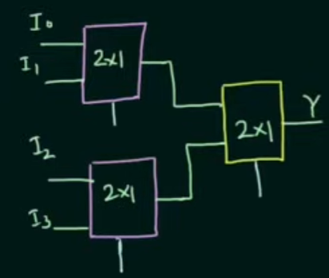
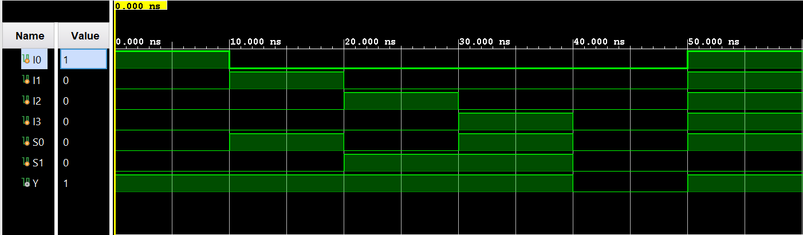

## 4:1 MUX Tree (Using 2:1 MUX) \| Verilog

A Verilog implementation of a **4:1 multiplexer (MUX) using a tree of 2:1 MUXes**, developed and simulated in the Vivado IDE. This document explains what a **multiplexer** is, what a **MUX tree** is, how a **4:1 MUX** behaves, how to **realize it using 2:1 MUXes**, derives the **Boolean equation**, summarizes the **circuit, waveform, and testbench results**, and provides steps to run the project in Vivado.

---

## Table of Contents

- [What Is a Multiplexer and MUX Tree?](#what-is-a-multiplexer-and-mux-tree)
- [4:1 MUX Tree Truth Table and Behavior](#41-mux-tree-truth-table-and-behavior)
- [Boolean Equation and 4:1 Realization](#boolean-equation-and-41-realization)
- [4:1 MUX Using 2:1 MUX Architecture](#41-mux-using-21-mux-architecture)
- [Learning Resources](#learning-resources)
- [Circuit Diagram](#circuit-diagram)
- [Waveform Diagram](#waveform-diagram)
- [Testbench Output](#testbench-output)
- [Running the Project in Vivado](#running-the-project-in-vivado)
- [Project Files](#project-files)

---

## What Is a Multiplexer and MUX Tree?

A **multiplexer (MUX)** is a combinational circuit that selects **one of several input signals** and forwards it to a **single output line**, based on the value of **selector inputs**.

In general:

- **n** = number of data inputs  
- **m** = number of select lines  
- They are related by: \( n = 2^m \)

Examples:

- A 2:1 MUX has 2 inputs, 1 select line.  
- A 4:1 MUX has 4 inputs, 2 select lines.  
- An 8:1 MUX has 8 inputs, 3 select lines.

### What Is a MUX Tree?

A **MUX tree** is a structured way of obtaining a **higher-order MUX using multiple lower-order MUXes**. When we connect lower-order MUXes in stages to build a higher-order function, the interconnection diagram forms a **tree-like structure**, hence the name **MUX tree**.

For this project, we build a **4:1 MUX** using **2:1 MUXes** arranged as a tree.

**Inputs and output for the 4:1 MUX:**

- **Inputs**
  - **I<sub>0</sub>**, **I<sub>1</sub>**, **I<sub>2</sub>**, **I<sub>3</sub>** — data inputs  
  - **S<sub>1</sub>**, **S<sub>0</sub>** — select lines (2 bits total)
- **Output**
  - **Y** — selected data output

### How Many 2:1 MUXes Are Required?

One intuitive way to compute the number of lower-order MUXes needed is **repeated division** by the lower-order MUX input size.

Example: **4×1 MUX using 2×1 MUX**

- Target: \( n = 4 \) inputs  
- Lower-order: 2:1 MUX

Divide repeatedly by 2 until the result is 1:

- \( 4 / 2 = 2 \)  
- \( 2 / 2 = 1 \)

Now **add all the intermediate results**:

- \( 2 + 1 = 3 \)

So **three 2:1 MUXes** are required to realize a **4:1 MUX** using a MUX tree.

Equivalently, for a full binary tree realization of an \( n:1 \) MUX using **2:1 MUXes**, the number of 2:1 MUXes is:

\[
$$\text{Number of 2:1 MUXes} = n - 1$$
\]

For \( n = 4 \), this gives \( 4 - 1 = 3 \), matching the repeated-division method.

---

## 4:1 MUX Tree Truth Table and Behavior

The **functional behavior** of a 4:1 MUX is defined by its **select lines**:

- **Selector variables:** S<sub>1</sub>, S<sub>0</sub> (2 bits)  
- **Inputs:** I<sub>0</sub>, I<sub>1</sub>, I<sub>2</sub>, I<sub>3</sub>  
- **Output:** Y

The **truth table** for a 4:1 MUX is:

| S<sub>1</sub> | S<sub>0</sub> | Y               |
|---------------|---------------|-----------------|
| 0             | 0             | I<sub>0</sub>   |
| 0             | 1             | I<sub>1</sub>   |
| 1             | 0             | I<sub>2</sub>   |
| 1             | 1             | I<sub>3</sub>   |

**Intuitive behavior:**

- The select lines **S<sub>1</sub> S<sub>0</sub>** form a 2-bit binary number.
- That number selects **which input appears on Y**:
  - S<sub>1</sub>S<sub>0</sub> = 00 → Y = I<sub>0</sub>  
  - S<sub>1</sub>S<sub>0</sub> = 01 → Y = I<sub>1</sub>  
  - S<sub>1</sub>S<sub>0</sub> = 10 → Y = I<sub>2</sub>  
  - S<sub>1</sub>S<sub>0</sub> = 11 → Y = I<sub>3</sub>

In the **MUX tree implementation** using 2:1 MUXes:

- **S<sub>0</sub>** is used as the **select line for the first stage** (the bottom two 2:1 MUXes).  
- **S<sub>1</sub>** is used as the **select line for the second stage** (the final 2:1 MUX at the top of the tree).

By trying a few cases (as confirmed by the simulation results), we see that this assignment of **S<sub>0</sub>** and **S<sub>1</sub>** yields the correct behavior of a 4:1 MUX.

---

## Boolean Equation and 4:1 Realization

From the truth table, the **Boolean expression** for **Y** in terms of **S<sub>1</sub>**, **S<sub>0</sub>**, and **I<sub>0</sub> … I<sub>3</sub>** is:

**Y = S<sub>1</sub>′ S<sub>0</sub>′ I<sub>0</sub>  
  + S<sub>1</sub>′ S<sub>0</sub> I<sub>1</sub>  
  + S<sub>1</sub> S<sub>0</sub>′ I<sub>2</sub>  
  + S<sub>1</sub> S<sub>0</sub> I<sub>3</sub>**

Where:

- **Adjacency (e.g., S<sub>1</sub>S<sub>0</sub>)** denotes **AND**.  
- **“+”** denotes **OR**.  
- The prime symbol **(′)** denotes the logical complement (NOT), e.g. **S<sub>1</sub>′** is the complement of S<sub>1</sub>.

Each product term corresponds to one row of the truth table and becomes active for a unique combination of **S<sub>1</sub>** and **S<sub>0</sub>**.

This equation is exactly the behavior we must reproduce with a **tree of 2:1 MUXes**.

---

## 4:1 MUX Using 2:1 MUX Architecture

The **4:1 MUX tree** using **2:1 MUXes** is built in **two stages**:

### Stage 1 – Lower-Level 2:1 MUXes

Use **two 2:1 MUXes**:

- **MUX<sub>0</sub>**  
  - Inputs: I<sub>0</sub>, I<sub>1</sub>  
  - Select: S<sub>0</sub>  
  - Output: W<sub>0</sub>

- **MUX<sub>1</sub>**  
  - Inputs: I<sub>2</sub>, I<sub>3</sub>  
  - Select: S<sub>0</sub>  
  - Output: W<sub>1</sub>

Conceptually:

- When S<sub>0</sub> = 0, each 2:1 MUX passes its “0” input (I<sub>0</sub> or I<sub>2</sub>).  
- When S<sub>0</sub> = 1, each 2:1 MUX passes its “1” input (I<sub>1</sub> or I<sub>3</sub>).

### Stage 2 – Upper-Level 2:1 MUX

Use **one additional 2:1 MUX**:

- **MUX<sub>2</sub>**  
  - Inputs: W<sub>0</sub>, W<sub>1</sub>  
  - Select: S<sub>1</sub>  
  - Output: Y

Behavior:

- When S<sub>1</sub> = 0 → Y = W<sub>0</sub> (selects between I<sub>0</sub> and I<sub>1</sub>).  
- When S<sub>1</sub> = 1 → Y = W<sub>1</sub> (selects between I<sub>2</sub> and I<sub>3</sub>).

Combining both stages, we obtain exactly the 4:1 MUX truth table:

- S<sub>1</sub> S<sub>0</sub> = 00 → Y = I<sub>0</sub>  
- S<sub>1</sub> S<sub>0</sub> = 01 → Y = I<sub>1</sub>  
- S<sub>1</sub> S<sub>0</sub> = 10 → Y = I<sub>2</sub>  
- S<sub>1</sub> S<sub>0</sub> = 11 → Y = I<sub>3</sub>

### Implementation Notes

- The Verilog modules are written as **pure combinational circuits** (no clocks or flip-flops).  
- The **2:1 MUX** (`twoOneMultiplexer.v`) is used as a **building block**.  
- The **4:1 MUX tree** (`fourOneMuxTree.v`) instantiates several 2:1 MUXes and connects them as described above.

This architecture synthesizes efficiently into FPGA LUTs or standard-cell logic.

---

## Learning Resources

| Resource | Description |
|----------|-------------|
| [Multiplexer Basics (YouTube)](https://www.youtube.com/results?search_query=multiplexer+basics) | Introductory explanation of multiplexers, select lines, and truth tables. |
| [4:1 MUX Using 2:1 MUX (YouTube)](https://www.youtube.com/results?search_query=4+to+1+multiplexer+using+2+to+1+mux) | Step-by-step explanation of building a 4:1 MUX tree from 2:1 MUXes. |
| [Digital Logic Design – MUX Trees (YouTube)](https://www.youtube.com/results?search_query=mux+tree+digital+logic) | Visualizes how MUX trees implement higher-order multiplexers. |
| [Vivado RTL Simulation Tutorials (YouTube)](https://www.youtube.com/results?search_query=vivado+rtl+simulation+tutorial) | Guides on setting up Verilog projects and running testbenches in Vivado. |

---

## Circuit Diagram

The **gate-level and structural** circuit for the 4:1 MUX tree can be viewed at two abstraction levels:

1. **Logical (Boolean) view** – based on the sum-of-products equation:  

   **Y = S<sub>1</sub>′ S<sub>0</sub>′ I<sub>0</sub> + S<sub>1</sub>′ S<sub>0</sub> I<sub>1</sub> + S<sub>1</sub> S<sub>0</sub>′ I<sub>2</sub> + S<sub>1</sub> S<sub>0</sub> I<sub>3</sub>**

2. **MUX-tree view** – where:
   - Two **2:1 MUXes** form the first level.  
   - One **2:1 MUX** forms the second level.  
   - Select lines are assigned as:
     - S<sub>0</sub> → lower-level MUXes (first stage).  
     - S<sub>1</sub> → upper-level MUX (second stage).

Key structural components:

- Three 2:1 MUX blocks arranged in a tree.  
- Internal wires (e.g., W<sub>0</sub>, W<sub>1</sub>) connecting the outputs of the lower MUXes to the inputs of the upper MUX.  
- Two shared select lines S<sub>1</sub>, S<sub>0</sub> distributed to the appropriate MUX stages.

If you have a schematic editor (such as in Vivado or any digital design tool), you can draw:

- Bottom row: two 2:1 MUXes with inputs (I<sub>0</sub>, I<sub>1</sub>) and (I<sub>2</sub>, I<sub>3</sub>), both controlled by S<sub>0</sub>.  
- Top row: one 2:1 MUX combining the two intermediate outputs, controlled by S<sub>1</sub>.



---

## Waveform Diagram

The **behavioral simulation waveform** illustrates:

- Inputs over time:
  - S<sub>1</sub>, S<sub>0</sub> (select lines)  
  - I<sub>0</sub>, I<sub>1</sub>, I<sub>2</sub>, I<sub>3</sub>
- The resulting output:
  - Y

Typical simulation scenarios include:

- Applying specific patterns to **I<sub>0</sub> … I<sub>3</sub>** and then sweeping **S<sub>1</sub> S<sub>0</sub>** through all four combinations.  
- Verifying that **Y** always equals the input selected by **S<sub>1</sub> S<sub>0</sub>**.

In this project, one representative test pattern is:

- For each select combination, set exactly **one input** high (1) and the rest low (0), and confirm that **Y** becomes 1 **only** when that input is selected.



---

## Testbench Output

The testbench applies a range of input combinations to verify that the MUX tree behaves correctly. A representative portion of the simulation log is:

```text
S1=0 S0=0 | I0=1 I1=0 I2=0 I3=0 | Y=1
S1=0 S0=1 | I0=0 I1=1 I2=0 I3=0 | Y=1
S1=1 S0=0 | I0=0 I1=0 I2=1 I3=0 | Y=1
S1=1 S0=1 | I0=0 I1=0 I2=0 I3=1 | Y=1
S1=0 S0=0 | I0=0 I1=0 I2=0 I3=0 | Y=0
S1=0 S0=1 | I0=1 I1=1 I2=1 I3=1 | Y=1
```

These results demonstrate that:

- For each select combination where **exactly one input is 1**, the output **Y = 1** and matches the selected input.  
- When **all inputs are 0**, **Y = 0**, regardless of the select lines.  
- When **multiple inputs are 1**, **Y** still equals **the selected input**, as shown by the last line (S<sub>1</sub> S<sub>0</sub> = 01 selects I<sub>1</sub> = 1, so Y = 1 even though I<sub>0</sub>, I<sub>2</sub>, and I<sub>3</sub> are also 1).

Overall, the simulation confirms that the **MUX tree implementation** of the 4:1 MUX matches the **truth table** and **Boolean equation**.

---

## Running the Project in Vivado

Follow these steps to open and simulate the **4:1 MUX tree using 2:1 MUX** design in **Vivado**.

### Prerequisites

- **Xilinx Vivado** installed (any recent edition that supports RTL simulation).

### 1. Launch Vivado

1. Open Vivado from the Start Menu (Windows) or your application launcher.  
2. Select the main **Vivado** IDE.

### 2. Create a New RTL Project

1. Click **Create Project** (or go to **File → Project → New**).  
2. Click **Next** on the welcome page.  
3. Choose **RTL Project**.  
4. Uncheck **Do not specify sources at this time** if you plan to add Verilog files immediately.  
5. Click **Next** to proceed to source file selection.

### 3. Add Design and Simulation Sources

1. In the **Add Sources** step, add your Verilog design and testbench files, for example:
   - **Design sources:**
     - `twoOneMultiplexer.v` — basic 2:1 MUX building block.  
     - `fourOneMuxTree.v` — 4:1 MUX implemented as a MUX tree using 2:1 MUXes:
       - Inputs: `I0`, `I1`, `I2`, `I3`, `S1`, `S0`  
       - Output: `Y`
   - **Simulation sources:**
     - `fourOneMuxTree_tb.v` — testbench that exercises different combinations of `S1`, `S0`, `I0`…`I3`, and observes `Y`.
2. After adding sources:
   - In the **Sources** window, under **Simulation Sources**, right-click your testbench file (e.g., `fourOneMuxTree_tb.v`) and choose **Set as Top**.
3. Click **Next**, select a suitable **target device** (for simulation, the default is fine), then **Next** and **Finish**.

### 4. Run Behavioral Simulation

1. In the **Flow Navigator** (left side), under **Simulation**, click **Run Behavioral Simulation**.  
2. Vivado will:
   - Elaborate the 4:1 MUX tree module as the DUT.  
   - Compile and open the **Simulation** view with waveform.
3. In the waveform window:
   - Add signals **S1, S0, I0, I1, I2, I3, Y** to the waveform.  
   - Confirm that **Y** matches the expected behavior for each combination of **S1** and **S0**.

### 5. (Optional) Modify and Re-run

- To make changes:
  - Edit the design file(s) (e.g., `fourOneMuxTree.v`, `twoOneMultiplexer.v`) or the testbench file (`fourOneMuxTree_tb.v`).  
  - Save the files.  
  - Use **Run Behavioral Simulation** again (or the **Re-run** button) to update results.

### 6. (Optional) Synthesis, Implementation, and Bitstream

If you want to map the MUX tree to FPGA hardware:

1. In **Sources**, right-click the **design** module (e.g., `fourOneMuxTree`) and choose **Set as Top** for synthesis.  
2. Run **Synthesis** and then **Implementation** from the Flow Navigator.  
3. Create a constraints file (e.g., `.xdc`) assigning FPGA pins for:
   - Inputs: `I0`, `I1`, `I2`, `I3`, `S1`, `S0`  
   - Output: `Y`
4. Run **Generate Bitstream** to produce the configuration file for your target FPGA.

---

## Project Files

- `twoOneMultiplexer.v` — RTL for the **2:1 multiplexer**, used as the fundamental building block.  
- `fourOneMuxTree.v` — RTL for the **4:1 multiplexer realized as a MUX tree using 2:1 MUXes**, implementing the logic:  
  \( Y = S_1' S_0' I_0 + S_1' S_0 I_1 + S_1 S_0' I_2 + S_1 S_0 I_3 \)  
- `fourOneMuxTree_tb.v` — Testbench that:
  - Drives different combinations of `S1`, `S0`, and `I0`…`I3`.  
  - Observes `Y` in the waveform and simulation log to verify correct behavior of the MUX tree.

---

*Author: **Kadhir Ponnambalam***
